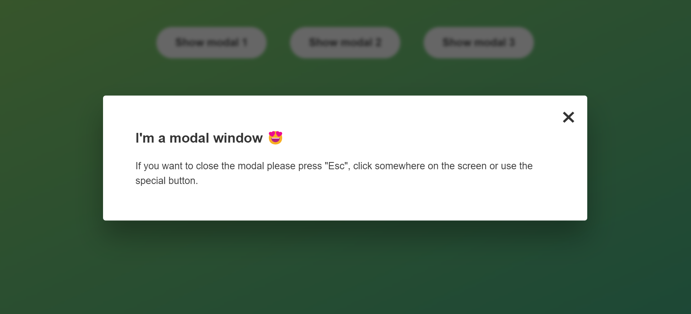

This is a solution to the [Modal window].

## Table of contents

- [Overview](#overview)
  - [The challenge](#the-challenge)
  - [Screenshot](#screenshot)
  - [Links](#links)
- [My process](#my-process)
  - [Built with](#built-with)
  - [What I learned](#what-i-learned)
  - [Continued development](#continued-development)
  - [Useful resources](#useful-resources)

**Note: Delete this note and update the table of contents based on what sections you keep.**

## Overview

This is a project from my learning journey using "The complete JavaScript course: From zero to expert ", from udemy platform.

The solution can be seen live on solution url.

### The challenge

Users should be able to:
-Use the project on different type of devices.

- Show the modal by pressing one of the show modal buttons.
  -Hide the modal by pressing the close-modal button.
  -Hide the modal by pressing the "Escape kye from keyboard.
  -Hide the modal by pressing the outside the modal

### Screenshot



### Links

- Solution URL: [https://miron-silviu.github.io/modal-window/]

## My process

I started the project by creating new branch "Feature/mobile-responsive" and in that branch I developed mobile first, after that I created "Feature/select-html-class-selection-and-project" branch, and in this branch I created the entire javaScript code.

### Built with

- Semantic HTML5 markup
- CSS custom properties
- Flexbox
- Mobile-first workflow

### What I learned

Use this section to recap over some of your major learnings while working through this project. Writing these out and providing code samples of areas you want to highlight is a great way to reinforce your own knowledge.

To see how you can add code snippets, see below:

```css
.proud-of-this-css {
  @media screen and (min-width: 120px) and (max-width: 790px) {
    body {
      background: #28b487;
    }
    .main-section {
      display: flex;
      flex-direction: column;
      justify-content: center;
    }
    .modal {
      height: 100%;
      overflow: auto;
      margin-top: 50rem;
    }
  }
}
```

```js
document.addEventListener('keydown', function (e) {
  if (e.key === 'Escape' && !modal.classList.contains('hidden')) {
    closeModal();
  }
});
};
```

### Useful resources

- [Example resource 1](https://www.udemy.com/course/the-complete-javascript-course/learn/lecture/22648445#overview)
